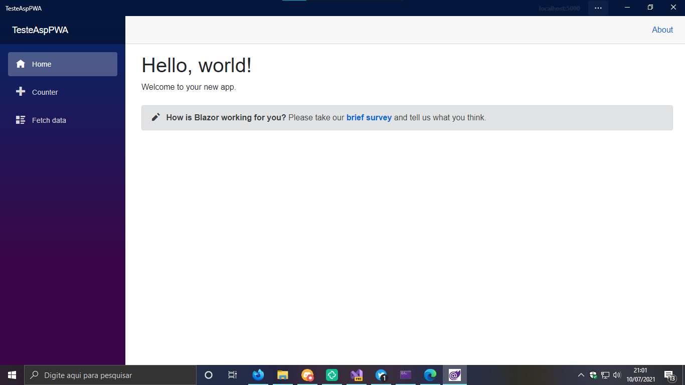

# Dia 10/07/2021 - Decidindo o caminho

Olá pessoal boa noite a todos 😁

Continuando sobre ontem que eu estava atrás de algo para usar como GUI, tive a ideia de utilizar Electron com o Blazor apesar de eu achar Electron pesado.

Iniciei um projeto simples de Electron junto de Typescript, nada fora do normal, ate eu iniciar um projeto blazor no mesmo projeto que se encontrava o meu electron, como de costume so não quis funcionar, pois um projeto de misturou com o outro e acabou que virou uma catastrofe.

Então fiquei pensando comigo sobre o que eu poderia utilizar, lembrei que no mesmo mundinho do Blazor existia uma tecnologia chamada PWA ([Progressive Web Application](https://developer.mozilla.org/pt-BR/docs/Web/Progressive_web_apps)), então acredito que seria interesante criar uma aplicação GUI usando PWA, tanto por ser mais facil a distribuição como ser muiltplataforma.

La fui eu criar criar um app de teste para aprender um pouco em como mexer com um PWA, junto do blazor, e pra varia sempre tem algo que me impede de algo funcionar de primeira, fiquei um tempo tentando descobrir como eu gerava o meu app PWA dentro do meu firefox, ate descobrir que simplesmente não esta funcionando 100% no desktop ainda, no Mobile ja esta funcionando (pelo menos na versão Nightly), pois eu utilizo no meu celular, então decidi utilizar o Edge mesmo para fazer isso, então tudo funcionou como esperado.

Bem agora irei entender mais como isso funciona, e talvez criar um mini app de login so pra brincar.

Espero que assim que eu aprender a usar o PWA que eu possa usar para fazer finalmente o meu projeto que tenho em mente a muito tempo.

Hoje foi mais um avanço para um projeto maior espero que logo logo eu posso apresentar a vocês o inicio dele.

Vejos todos amnhã novamente, tenham uma boa noite a todos 😁
