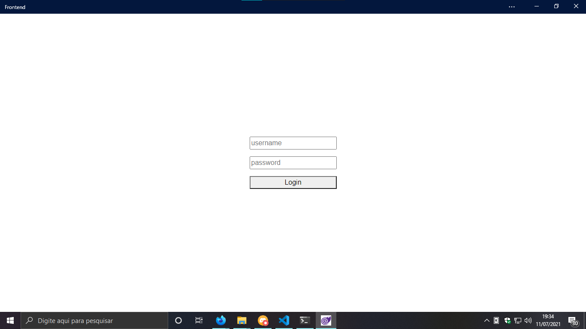
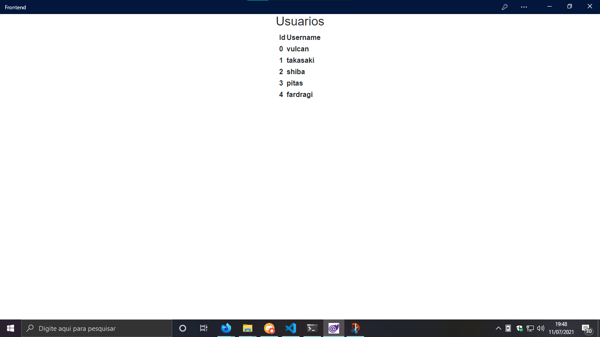

# Dia 11/07/2021 - Mini PWA

Olá pessoas maravilhas que estão lendo o meu blog, hoje venho trazer a vocês o que foi prometido ontem, um mini login usando Blazor.

Essa noite passei estudando um pouco de como é fazer uma API usando [Actix-Web](https://github.com/actix/actix-web), que usa a linguagem Rust, não é muito difícil, é até interessante o como é simples fazer uma, se assemelha com fazer uma API em [Express](https://github.com/expressjs/express).

```rust
use actix_web::{get, App, HttpServer, Responder};

#[get("/")]
async fn index() -> &'static str {
    "Olá mundo"
}

#[actix_web::main]
async fn main() -> std::io::Result<()> {
    HttpServer::new(|| App::new().service(index))
        .bind("127.0.0.1:8080")?
        .run()
        .await
}
```

Então se eu colocar no meu navegador `http://localhost:8080` eu irei receber `Olá mundo`, nada muito complexo até aqui.

Então hoje de manhã eu ia começar a codar o back end da minha aplicação so para simular a funcionalidade de login, mas um amigo meu chamado [Takasaki](https://github.com/Takasakiii), quis me apresentar uma outra maneira de fazer API's usando Rust, que é usando a lib [Rocket](https://github.com/SergioBenitez/Rocket), não é tão diferente do Actix-Web, mas como ele quis fazer o back end para mim eu não recusei que ele utilizasse o Rocket, até mesmo por que eu queria aprender algo novo.

Aqui um exemplo a mesma API so que usando Rocket

```rust
// Espero que seja assim, pois eu não mexi muito com a API

#[macro_use]
extern crate rocket;

#[get("/")]
fn hello() -> &'static str {
    "Olá mundo"
}

#[launch]
fn main() -> _ {
    rocket::build().mount("/", routes![hello])
}
```

Talvez vocês esteja se perguntando aonde ta a configuração da porta da API, ela fica em um arquivo separado.

```toml
# Rocket.toml

[default]
port = 8080
address = "127.0.0.1"
```

Bem, após a construção a API, que o Takasaki fez pra mim, eu comecei a fazer a aplicação [Blazor](https://dotnet.microsoft.com/apps/aspnet/web-apps/blazor), inicialmente eu tentei fazer via CLI do dotnet com o comando:

```ps
# Aqui eu estava usando o .Net 5

dotnet new blazorwasm --pwa
```

Mas ele teve alguns problemas com o certificado SSL que o dotnet embarca junto para ambiente de desenvolvimento, fora que eu tentava usar o hot reload e não funcionava (Sim talvez era so frescura, mas ficar aceitando toda hora no Firefox que a url não é segura é um pouco chato), então decidi criar o projeto no Visual Studio 2019, mas como sempre as coisas não colaboram comigo, o VS so parava de responder antes de eu criar o projeto.

Por sorte eu tenho instalado a previa do Visual Studio 2022, então fui criar o projeto por ele já que ele está funcionando muito melhor no meu PC sem nenhum travamento, só que com um porem, so está aparecendo o [.Net 6 - Preview](https://dotnet.microsoft.com/download/dotnet/6.0), então caso queira testar instale essa versão.

Após eu criar o projeto comecei a o template, deletei alguns arquivos que eu não iria usar, mas alguns deixei de base, pois faz um belo tempo que eu não programo em C#, fiz a tela inicial de login, apesar de bem simples tentei deixar minimamente bonito.



```md
<!-- Para quem quiser testar -->

# Username: vulcan
# Password: 123
```

Bem juro que tive um mini dificuldade de fazer essa parte, pois eu não lembrava exatamente como fazia uma chamada http no C#, isso por que eu fiz um projeto enorme com C# e não faz muito tempo, mas também quis ver as novidades do .Net 6, a chamada http nova fica assim:

```cs
using(var http = new HttpCLient()) {
    var response = await http.PostAsJsonAsync("<url>", new {
        username // variavel local,
        password // variavel local
    });

    if (response.StatusCode == System.Net.HttpStatusCode.Accepted)
    {
        var user = await response.Content.ReadFromJsonAsync<User>();

        Console.WriteLine(user.Username);

        // a sessionStorage é como eu salvo o token no navegador
        await sessionStorage.SetItemAsync("user", user);

        // Mudar de uma pagina para a outra
        navManager.NavigateTo("/users");
    }
}

record User(string Username, string Token);
```

A meu ver ficou bem mais simples de fazer chamadas usando o formato json, antes era preciso fazer a conversão manualmente.

Após fazer o login sou redirecionado para a página que contém todos os usuários registrador no banco de dados, caso queira registrar mais usuários é so editar esse arquivo [database.rs](backend/src/database.rs).

```md
<!-- Sim todas as senhas são 123 -->
```



Bem acredito que PWA não seja algo difícil de se fazer, ainda estou entre se uso Actix-Web ou Rocket para o projeto que pretendo fazer, mas acredito que Blazor ja está quase 100% decidido que eu usarei.

Caso queira executar o projeto você ter instalado na sua máquina e executar os comandos em dois terminais diferente:

```ps
# Rust: 1.53.0
# .Net: 6.0

# Na pasta backend
cargo run

# Na pasta frontend
dotnet run
```

Hoje foi bem produtivo, espero continuar assim essa semana, vejo todos novamente amanhã, com talvez o escopo do meu projeto que pretendo fazer.

Bye bye.

## Comentarios sobre o assunto

Eu tinha colocado o retorno da api com String, mas como nessa discussão me foi explicado que posso colocoar no lugar `&'static str`.

[Motivo de ser `&'static str` - Takasakiii](https://github.com/Gabriel-Paulucci/UmDiaProgramando/discussions/4)
