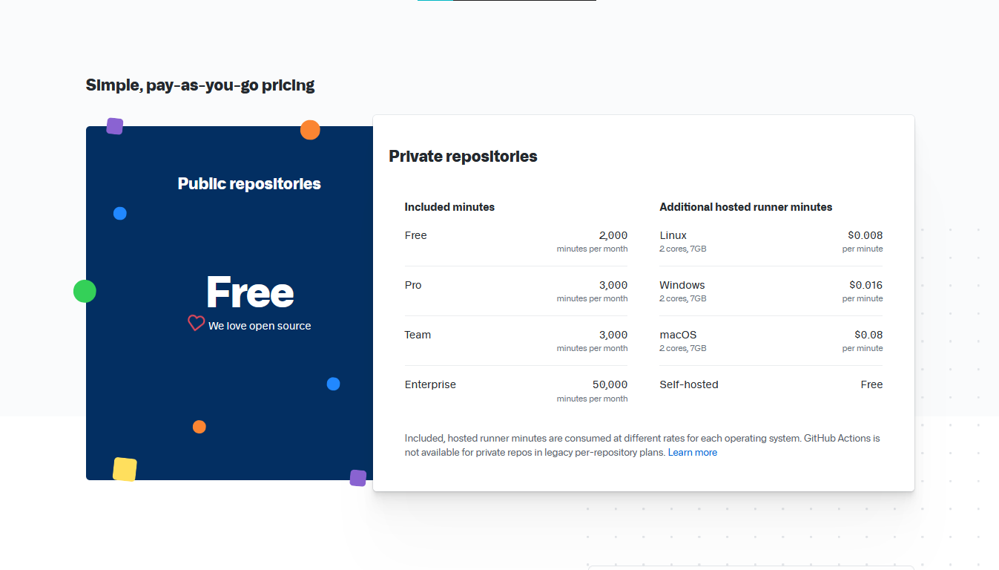
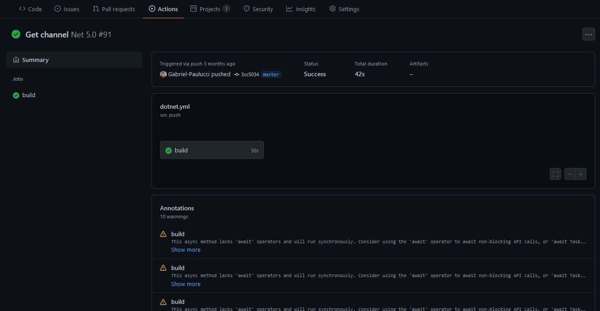

# Dia 20/07/2021 - Github Actions

Boa noite pessoal, como estão ? Espero que bem.

Hoje trago a vocês algo que eu uso muito, e decidi compartilhar, como eu faço e algumas dicas, como ja ta no título vou falar sobre o github actions, uma ótima maneira de você fazer testes, dar build, publicar, até alterar alguma coisa no projeto e também não se limitando a somente isso, pois você tem acesso a uma VM para manipular da forma que precisar o seu codigo.

Bem vamos lá, para começar a usar isso, vem aqui algumas dicas iniciais para não se frustra quando começar a usar, existem dois planos básicos para se usar ele, o de graça é o pago, a unica diferença entre eles é que você so pode usar o de graça de ele for público o seu repositório, mas e o pago? Bem ele você também pode usar mais ele tem um limite de uso, e após isso ele se torna verdadeiramente pago.



Tradução

| Plano | Minutos inclusos |
| - | - |
| Free | 2.000 minutos por mês |
| Pro | 3.000 minutos por mês |
| Team | 3.000 minutos por mês |
| Enterprise | 50.000 minutos por mês |

Caso ultrapasse esses limites e queira continuar usando, esses são os preços para cada OS que você estiver usando dentro das actions.

| Os | Preço |
| - | - |
| Linux 2 cores, 7Gb | $0,008 por minuto |
| Windows 2 cores, 7Gb | $0,016 por minuto |
| macOS 2 cores, 7Gb | $0,08 por minuto |
| Self-hosted | de graça |

Nota:
Self-hosted, ele executara na sua própria maquina as actions, você pode fazer isso em um servidor próprio caso desejar.

Agora vamos realmente para a parte de como fazer as actions.

Para criar uma action, primeiro você deve criar uma pasta na raiz do seu projeto para ele ser reconhecido pelo github, o nome desta pasta deve ser `.github/workflows`, dentro dela será aonde será colocado as actions.
Todos os arquivos de actions tem a extensão do arquivo em `.yml`, mas o nome delas fica a sua escolha, e podem ser colocados quantas forem necessárias.

Para iniciar a criação de uma deve ser definido o nome da action dentro do arquivo.

```yml
name: Github Action
```

Apos isso deve ser definido qual será o gatilho dessa ação usando a tag `on`, existem uma infinita variedade do que pode ser o acionador, vou listar alguns que eu acho mais importantes.

[Lista com todos](https://docs.github.com/en/actions/reference/events-that-trigger-workflows)

## Schedule

Ele serve para acionar a action através do tempo definido, lembrando que ele usa o horário UTC.

```yml
on:
  schedule:
    - cron: '0 12 * * *'
```

O codigo acima faz com que ele acione todo dia ao meio dia.

```yml
on:
  schedule:
    - cron: 'm h d M D'
```

| Letra | Significado |
| :-: | - |
| m | Minutos |
| h | Horas |
| d | Dias |
| M | Meses |
| D | Dias da semana |

Existem alguns operadores para fazer com que rode em mais de uma hora, ou de tempo em tempo.

| Operador | Significado | Exemplo | Descrição |
| :-: | - | - | - |
| * | Todos os valores | `'* * * * *'` | A todo minuto |
| , | Lista de valores | `'0,30 8,16 * * *'` | As 8h, 8h30, 16h e 16h30 todo dia
| - | Intervalo de valores | `'0 12 * * 1-5'` | As 12h de Segunda a Sexta |
| / | Tempo em tempo | `'0/15 * * * *'` | De 15 em 15 minutos |

## Push

Acredito que seja o mais utilizado, pois ele é acionado a cada commit feito no github, tirando em casos que os commit são enviados juntos ele pegará o ultimo enviado, e pode ser direcionado em uma branche específica.

```yml
on:
  push:
    branches: # opcional
      - master
```

## Pull request

Ele é utilizado mais para fazer o acionamento das actions quando alguém envia um PR para o seu repositório, assim podendo fazer qualquer validação antes mesmo de ele estar dentro do repositório oficialmente.

```yml
on:
  pull_request:
    branches: # opcional
      - master
```

## Release

Essa tag ela á usada para quando você cria uma nova versão do seu projeto, a action seja acionada para criar algum publish no NPM, no Docker ou em qualquer outro serviço parecido.
No caso do Release n é obrigatório ser definido um tipo mas com isso todo os tipo acionam essa action, então é interesante limitar ela.

[Lista dos tipos](https://docs.github.com/en/actions/reference/events-that-trigger-workflows#release)

```yml
on:
  release:
    type: # opcional
      - created
```

## Workflow dispatch

Ela é usada para ser possivel o acionamento manual da action, é interesante para casos bem específicos aonde acionar a action não tenha algo haver com algum evento, ou para fins de teste.

```yml
on:
  workflow_dispatch:
```

Esses acionadores podem ser colocados juntos, não tem algo expecifico limitando eles há não funcionarem juntos, podendo ficar assim a parte dos acionadores das actions.

```yml
on:
  workflow_dispatch:
  push:
    branches: # opcional
      - master
  pull_request:
    branches: # opcional
      - master
```

Após isso vem a parte de definir o que deve ser feita na action, como por exemplo definir qual será o OS que vai executar essa função, quais os comandos devem ser executados, as vezes qual versão da lang deve ser usada entre uma infinidade de coisas.
Irei mostrar como ficaria uma build de um programa feito em C#.

```yml
name: .NET Core

on:
  push:
    branches: [ master ]
  pull_request:
    branches: [ master ]

jobs:
  build:

    runs-on: windows-latest

    steps:
    - uses: actions/checkout@v2
    - name: Setup .NET Core
      uses: actions/setup-dotnet@v1
      with:
        dotnet-version: 5.0.x
    - name: Install dependencies
      run: dotnet restore
    - name: Build
      run: dotnet build --no-restore
    - name: Test
      run: dotnet test --no-restore --verbosity normal
```

Como mencionado antes é definido um nome é o que irá acionar essa action, apos isso será definida uma propriedade `jobs`, aonde será definido quais ações serão feitas dentro dessa action.

```yml
jobs:
  build: # esse nome é a sua escolha
    runs-on: windows-latest # definindo qual OS usar
```

Essa é uma configuração basica, de qual ação sera feita e qual sistema será usado, os sistemas disponiveis são:

| OS | Nome |
| - | - |
| Windows Server 2019 | `windows-latest` ou `windows-2019` |
| Windows Server 2016 | `windows-2016` |
| Ubuntu 20.04 | `ubuntu-latest` ou `ubuntu-20.04` |
| Ubuntu 18.04 | `ubuntu-18.04` |
| macOS Big Sur 11 | `macos-11` |
| macOS Catalina 10.15 | `macos-latest` ou `macos-10.15` |

E caso deseje existe uma maneira de executar em mais de um OS de uma vez de maneira simples.

```yml
jobs:
  build:
    strategy:
      matrix:
        platform:
          - ubuntu-latest
          - macos-latest
          - windows-latest

    runs-on: ${{ matrix.platform }}
```

Agora é aonde realmente começamos com o que será executado, dentro da propriedade `steps`, será aonde escreveremos o nosso fluxo para executar alguma ação.
Sempre que vamos iniciar os `steps`, precisamos usar uma espécie de lib que podem ser incluídas nas actions, e que por sinal são como são programadas algumas ações para poderem ser usadas dentro das actions.
Essa lib que precisamos por se chama `actions/checkout@v2`, com ela será verificado se está tudo certo com nosso repositório para poder executar a nossa action.
Caso queira saber mais sobre ela aqui esta o [link](https://github.com/actions/checkout) dela.

```yml
jobs:
  build:
    runs-on: ubuntu-latest
    steps:
      uses: actions/checkout@v2
```

Após isso sempre que foi adicionado mais alguma ação sempre será exigido adicionar uma propriedade `name` para fazer a identificação do que está sendo feito.

```yml
jobs:
  build:
    runs-on: ubuntu-latest
    steps:
      uses: actions/checkout@v2
    - name: Setup .Net Core # sim precisa ser dessa forma com -
      uses: actions/setup-dotnet@v1
      with:
        dotnet-version: 5.0.x # o nome dessa variavel vem da action
```

Nesse caso eu defini o nome, e chamei outra action (como realmente é chamado), para eu definir qual versão do .Net Core eu irei usar, eu uso a propriedade `with` para poder passar as variáveis para dentro da action.

Após isso eu so executo os mesmos comandos que seriam executados na minha própria máquina para fazer a build.

```yml
jobs:
  build:
    runs-on: windows-latest
    steps:
    - uses: actions/checkout@v2
    - name: Setup .NET Core
      uses: actions/setup-dotnet@v1
      with:
        dotnet-version: 5.0.x
    - name: Install dependencies
      run: dotnet restore # baixar as dependencias
    - name: Build
      run: dotnet build --no-restore # dar build
    - name: Test
      run: dotnet test --no-restore --verbosity normal # testar
```

Com isso quando eu acionar essa action o Github vai processar ela e me dizer se foi tudo feito com sucesso.



Existem muitas outras coisas que podem ser feitas com o Github Action, esse é um tema muito vasto, então não vou conseguir colocar tudo aqui mas com o tempo vou escrevendo mais artigos como esse explicando alguma coisa sobre como usá-los, ou dicas, caso tenha ficado alguma dúvida, ou queira saber algo específico não hesite em mandar algo no [Discussions](https://github.com/Gabriel-Paulucci/UmDiaProgramando/discussions)

Na pasta workflows tem um exmplo um pouco mais detalhado sobre essa mesma action aque apresentei a vocês.
Muito obrigado por lerem e vejo todos amanhã novamente, bye bye.
