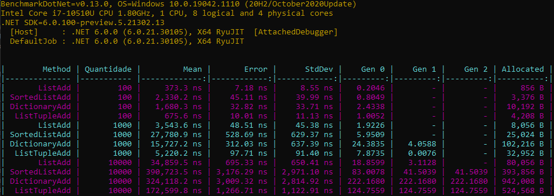
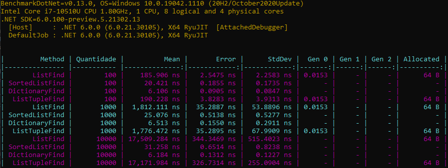

# Dia 21/07/2021 - Benchmark de listas em C#

Olá pessoa tudo bem com todos ?

Eu estava aqui pensando, faz um tempo que precisei fazer esse teste para saber o que usar na minha aplicação, eu estava em usar `List`, `SortedList` e `Dictionary`, então utilizei uma lib bem conhecida no .Net para fazer esses testes, que é o [BenchmarkDotNet](https://github.com/dotnet/BenchmarkDotNet), então vim aqui mostrar os resultados do meus testes, e espero que aprendam algo com eles, e como curiosidade eu coloquei uma lista de tuplas, so para saber o que acontece.

Eu separei os testes em duas pastes, a de inserção e a de busca, para saber qual seria melhor em cada situação.

## Inserção

Na parte de inserção, eu criei uma classe so para usar de teste que continha somente o Id, então fiz a inserção de 100, 1.000 e 10.000, para saber o quando isso mudaria, em todos os casos o que melhor se saiu na inserção foi a lista, eu ja imaginava esse resultado pois a maneira que ela é inserida não é nada de mais, ja o `SortedList`, foi o mais pesado pois ele faz uma reorganização de cada item para ser mais otimizado na busca e no caso do `Dictionary`, ele ficou bem mais proximo do sorted mas o seu consumo de memoria foi muito mais alto chegando a ser quatro vezes maior.

A inserção de todos foi basicamente a geração de um array com o tamanho definido, e usando a função de adicionar de cada uma das listas.

```cs
var pessoasArray = new Pessoa[Quantidade];

for (int i = 0; i < Quantidade; i++)
{
    pessoasArray[i] = new Pessoa(i);
}

// o que foi contado no benchmark esta abaixo

List<Pessoa> pessoas = new();

for (int i = 0; i < Quantidade; i++)
{
    pessoas.Add(pessoasArray[i]);
}
```

Uma dica sempre importante de quando se esta utilizando o `List` é que sempre que possivel, ja inicializar com o tamnho mais proximo do que será realmente utilizado, assim o deixando mais rapido para inserção, pois não terá o tempo da alocação de memoria.

```cs
List<Pessoa> pessoas = new(Quantidade);
```

Caso queira ver o codigo todo que eu fiz para realizar esses testes, eles estão na pasta `benchmark`.

Apos fazer esses testes o resultado foi.



## Busca

Para fazer a busca dos dados, eu utilizei a forma mais aconselhável de fazer isso, pois sei que e possivel fazer usando o `Linq`, que é uma lib feita para buscas em listas e também usada muito em ORM, mas para ser obtida a melhor eficiência de cada tipo de lista, utilizei a própria que é me disponibilizada pelas classes.

Exemplo de codigo usando o linq para busca em um dicionario.

```cs
Dictionary<int, Pessoa> pessoas = new();

pessoas.First(x => x.Value.Id == Quantidade - 1);
```

Maneira correta de fazer uma busca no dicionario.

```cs
Dictionary<int, Pessoa> pessoas = new();

pessoas.TryGetValue(Quantidade - 1, out var pessoa)
```

Mas o primeiro caso não é inútil, ele pode ser usado caso o elemento de busca não seja pela key que está no dicionário, mas sempre prefira que seja por ela.

A maneira de busca que foi feita para esse teste, foi buscar o ultimo numero inserido, com isso dando o pior caso possivel em uma lista.

```cs
List<Pessoa> pessoas = new();

var pessoa = pessoas.Find(x => x.Id == Quantidade);
```

E bem sobre os resultados, como de se esperar o `Dictionary` é o mais rapido para buscas, pois no C# ele internamente usa uma tabela hash para ordenar os dados, ja a `List` foi a pior de todas pois, a maneira que ela faz a busca é sequencial, ou seja vai item por item buscando e o `SortedList`, apesar de ter sido mais devagar que o `Dictionary`, ele manteve uma ótima performance na busca.

Em ambos os casos do `Dictionary` e `SortedList`, eles manterão a busca dos dados constante independentemente da quantidade de itens, apesar de que sempre vai ter uma leve subida conforme é adicionado mais itens.

Caso queira ver o codigo todo que eu fiz para realizar esses testes, eles estão na pasta `benchmark`.

Apos fazer esses testes o resultado foi.



## Conclusão

Bem após fazer todos esses testes, cheguei a conclusão de que, a `List`, ela é boa para ser usada quando vai ser manipulado quantidades baixas de dados, algo em torno de 20 eu acredito ou até um pouco mais, mas sempre será bom dar uma olhada se alguma outra lista pode ser usada no lugar.

Ja o `Dictionary` ele é ótimo para buscar itens, ele é o mais rapido de todos, mas tem um alto custo de memória para isso acontecer.

O `SortedList` é o meio termo digamos, não tem um custo alto na memória, mas o seu desemprenho é muito melhor que uma list, então sempre que possivel colocar ele no mínimo, mas caso seja algo que será muito requisitado colocar um `Dictionary`.

E como bônus `List<ValueTuple>`, esse foi mais uma curiosidade do que realmente algo para levar em conta, pois ele gera um cenário totalmente horrível.

## Enceramento

Caso tenham algo a acrescentar não tenham medo de abrir uma discussão no github, estarei aqui lendo todas as opiniões, ou caso tenha alguma dúvida sobre o tema eu responderei.

Bem obrigado por lerem vejo todos amanhã novamente bye bye.
